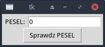

# PESEL tester

Prosta aplikacja desktopowa w Pythonie (Tkinter), która sprawdza poprawność numeru PESEL na podstawie oficjalnego algorytmu (suma kontrolna). Aplikacja może zostać elementem większego systemu, gdzie potrzebna jest walidacja numeru PESEL

ℹ️ Informacja historyczna

Projekt powstał w latach 2016–2018 jako proste narzędzie do weryfikacji numeru PESEL. Został nieznacznie odświeżony przed publikacją (m.in. usunięcie zbędnych importów, drobna refaktoryzacja), ale celowo zachowano jego pierwotny minimalizm i strukturę z czasów, gdy powstała.


# Zrzut ekranu


## Jak uruchomić

1. Upewnij się, że masz zainstalowanego Pythona (3.6+)
2. Pobierz repozytorium:
   ```bash
   git clone https://github.com/CodeTruckerDev/PESEL-tester

# TODO lista rozwojowa
Walidacja danych wejściowych

- Sprawdź, czy użytkownik wpisał dokładnie 11 cyfr

- Pokaż ostrzeżenie, jeśli długość lub typ danych są błędne

Czysta separacja logiki

- Przenieś algorytm sprawdzania PESEL-a do osobnej funkcji is_valid_pesel(pesel_str)

Lepsze GUI

- Opcjonalnie zamiast zmieniać tekst przycisku, dodaj osobny Label do pokazywania komunikatu (zielony/czerwony tekst)

- Dodaj przycisk „Wyczyść” do resetowania formularza

Dodatkowe funkcje (opcjonalnie)

- Odczytaj datę urodzenia z PESEL-a i pokaż ją w GUI

- Rozpoznaj płeć (na podstawie 10. cyfry — parzysta = kobieta, nieparzysta = mężczyzna)


---
> "Nie jestem programistą z zawodu. Jestem nim z powołania."
